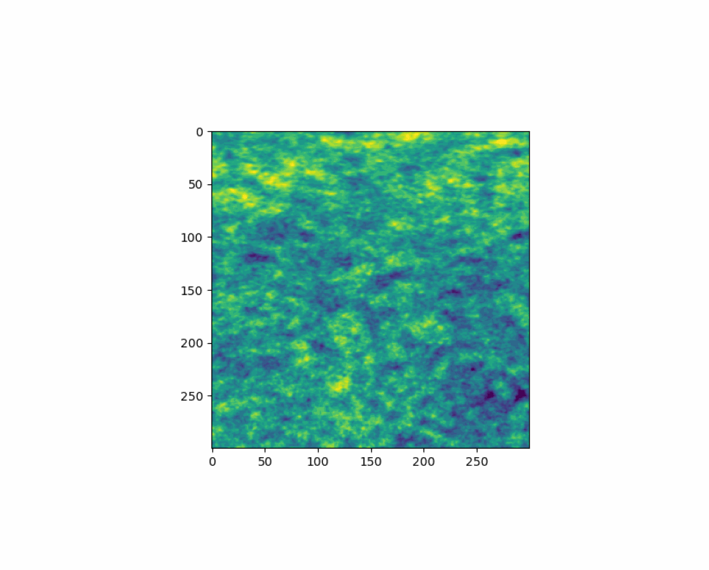

<center>


</center>
# cunuSHT
general (adjoint) spin-n SHTs.

cunuSHT provides functions to calculate spherical harmonic transforms for any uniform and non-uniform grid.

It can run on both, CPU and GPU, and can do this for (custom) geometries.

Operators:

 - `synthesis_general()`: takes SHT coefficients and (possibly non-uniform) grid points at which they are to be evaluated and returns the SHT transformed position space data (a map).
 - `adjoint_synthesis_general()`: this is the adjoint operation, takes a map with (possibly non-uniform grid points) and returns the SHT coefficients for a uniform grid. 
 - `gclm2lenmap()`: similar to synthesis_general, but automatically performs dlm2pointing, iff no pointing is provided
 - `lenmap2gclm()`: similar to adjoint_synthesis_general, but again, perfroms dlm2pointing if needed.
 - `dlm2pointing()`: calculates the non-uniform grid points (pointing) from the coefficients of a deflection field (dlm).


## Installation

Currently in 2 steps:

Enter the `cunusht/c` folder, and compile the C and CUDA library, and install the python module via the `pyproject.toml`

```
cd cunusht/c
pip install .
```

Then, go to the root directory, and install `cunusht`:

```
cd ./../../
python3 setup.py install
```

## usage

While somewhat cumbersome, the current interface works as follows.

Set parameters,

```
kwargs = {
    'geominfo': ('gl',{'lmax':1023}),
    'planned': True,
    'single_prec': False
}
```

Construct your transformer,
```
import cunusht
t = cunusht.get_transformer(solver='cufinufft', backend='GPU')
t = t(**kwargs)
```


### gclm2lenmap()

The function depends on,

- gclm: the SHT coefficients at the uniform grid points
- ptg: the (non-uniform) grid points (the pointing) for which the pointmap should be evaluated
- dlm(_scaled): the deflection field that is used to calculate pointing, iff ptg is not provided. Note, for the GPU backend, this is dlm_scaled and must be `dlm * np.sqrt(1/l(l+1))`.
- lmax: the pointmap maximum SHT multipole
- mmax: the dlm_scaled
- epsilon: the target accuracy
- nthreads: the numnber of threads to be used (number of available CPUs is a good number)
- lenmap: the output

Choose your parameters, then

```
t.gclm2lenmap(gclm=gclm, dlm_scaled=dlm_scaled, lmax=lmax, mmax=lmax, epsilon=epsilon, nthreads=nthreads, lenmap=lenmap)
```

### lenmap2gclm()

This is the adjoint (inverse) operation of `gclm2lenmap()`, if lenmap is not quadrature weighted (is multiplied by the maginification matrix, and quadrature weighted).

Similar to above,

```
t.lenmap2gclm(lenmap, dlm_scaled=dlm_scaled, lmax=lmax, mmax=lmax, epsilon=epsilon, nthreads=10 gclm=gclm)
```